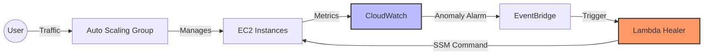

# Chaos Engineering & Self-Healing SRE Pipeline

This project is a production-ready, cloud-native infrastructure designed to minimize Mean Time to Recovery (MTTR) through autonomous self-healing and predictive monitoring. It demonstrates an end-to-end implementation of Site Reliability Engineering (SRE) principles on AWS, managed via modern CI/CD and IaC workflows.

## Tech Stack & Tools

* **Infrastructure as Code (IaC):** Terraform (State managed via AWS S3 Backend)
* **Cloud Infrastructure:** AWS (EC2, Auto Scaling Groups, VPC, IAM, CloudWatch, EventBridge, Lambda)
* **Predictive Monitoring:** AWS CloudWatch Anomaly Detection (Machine Learning)
* **Automation:** AWS Systems Manager (SSM) Run Command
* **Resilience:** Auto Scaling Group (ASG) & Multi-AZ Deployment
* **Security:** IAM Least Privilege Principle
* **CI/CD Pipeline:** GitHub Actions (Automated validation, planning, and deployment)

## Key Features

1. **Autonomous Self-Healing Loop:** Implemented a closed-loop remediation system. Performance anomalies are detected in real-time, triggering an automated workflow to fix issues (e.g., process termination) without human intervention.
2. **Machine Learning-Driven Monitoring:** Utilized CloudWatch Anomaly Detection to move beyond static, error-prone thresholds. The system uses ML models to learn normal performance patterns and proactively flag drifts.
3. **Production-Grade CI/CD/IaC:** Automates infrastructure lifecycle management using GitHub Actions. Every change is validated, planned, and applied automatically, ensuring state consistency using remote S3 backends.
4. **Resilience & Fault Tolerance:** Deployed using Auto Scaling Groups (ASG), ensuring that the system automatically maintains desired capacity and handles instance failures across Availability Zones.
5. **Operational Security:** Enforced strict IAM role-based access control, ensuring the "Least Privilege" principle is maintained across all automation triggers.

## System Architecture

## Workflow

*   **Detection:** AWS CloudWatch ML-based models monitor system performance patterns.
*   **Alerting:** An anomaly triggers an alarm, and EventBridge intercepts the state change.
*   **Remediation:** A Lambda function executes an SSM Command remotely to fix the identified issue instantly.
*   **Consistency:** All changes are version-controlled and deployed through an automated pipeline, ensuring a single source of truth for infrastructure.

---
*Created by **Mevinu Methdam** | SRE/DevOps Learner*
