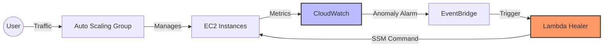

# Chaos Engineering & Self-Healing SRE Pipeline

This project demonstrates a production-grade, cloud-native infrastructure featuring automated self-healing and high-availability mechanisms on AWS.

## Tech Stack & Tools

* **Infrastructure as Code (IaC):** Terraform
* **Cloud Platform:** AWS (EC2, Auto Scaling Groups, VPC, IAM, CloudWatch, EventBridge, Lambda)
* **Monitoring & Alerting:** CloudWatch Anomaly Detection (Predictive Monitoring)
* **Automation:** AWS Systems Manager (SSM) Run Command
* **Resilience:** Auto Scaling Group (ASG) & Multi-AZ Deployment
* **Security:** IAM Least Privilege Principle

## Key Features

1. **Self-Healing Architecture:** Detects performance degradation (CPU spikes/Disk issues) via CloudWatch, triggers an EventBridge rule, and invokes a Lambda function to execute automated fixes via AWS SSM.
2. **Predictive Monitoring:** Replaced static thresholds with AWS CloudWatch Anomaly Detection, utilizing machine learning to identify performance drifts proactively.
3. **High Availability:** Implemented an Auto Scaling Group (ASG) across multiple Availability Zones to ensure fault tolerance and continuous service availability.
4. **Security Best Practices:** Enforced IAM roles with minimal permissions, adhering to the principle of least privilege.

## System Architecture

## Workflow

*   **Detection:** CloudWatch Anomaly Detection monitors CPU Utilization patterns using machine learning.
*   **Response:** Upon an alarm state change, EventBridge redirects the event to the Auto-Healing Lambda function.
*   **Correction:** The Lambda function utilizes AWS Systems Manager (SSM) to remotely execute remediation scripts (e.g., process termination, file cleanup) on the affected instance without manual intervention.

---
*Created by **Mevinu Methdam** | SRE/DevOps Learner*
